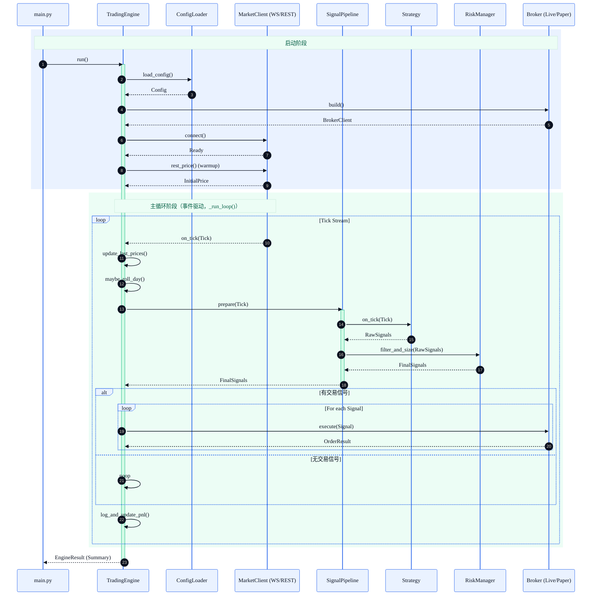
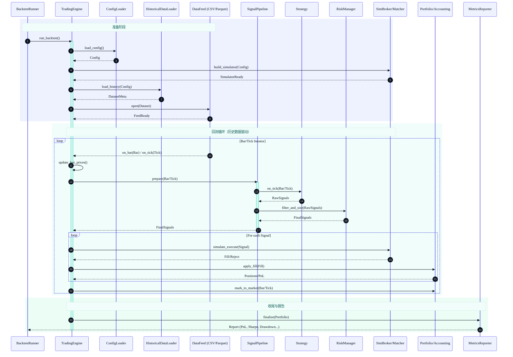

# 交易引擎时序图 (Trading Engine Sequence Diagram)

本文包含两套时序图：

- 实盘/纸盘：实时行情驱动，交易通过 Broker 真实下单或模拟下单。
- 回测：历史数据驱动，撮合/滑点/手续费由回测撮合器模拟，最终生成绩效报告。

## 实盘/纸盘 (Live/Paper Trading)

```mermaid
%%{init: {'theme':'base','themeVariables': {'fontFamily':'Inter, ui-sans-serif, system-ui, -apple-system, Segoe UI, Roboto, Helvetica, Arial','textColor':'#0B1220','lineColor':'#1F2937','signalColor':'#0B1220','actorBkg':'#EAF2FF','actorBorder':'#2563EB','actorTextColor':'#0B1220','noteBkgColor':'#ECFDF5','noteTextColor':'#065F46','activationBkgColor':'#D1FAE5','activationBorderColor':'#10B981'}}}%%
sequenceDiagram
    autonumber
    participant Main as main.py
    participant Engine as TradingEngine
    participant Config as ConfigLoader
    participant Market as MarketClient (WS/REST)
    participant Pipeline as SignalPipeline
    participant Strategy as Strategy
    participant Risk as RiskManager
    participant Broker as Broker (Live/Paper)

    rect rgb(234, 242, 255)
        note over Main,Broker: 启动阶段
        Main->>Engine: run()
        activate Engine
        Engine->>Config: load_config()
        Config-->>Engine: Config

        Engine->>Broker: build()
        Broker-->>Engine: BrokerClient

        Engine->>Market: connect()
        Market-->>Engine: Ready
        Engine->>Market: rest_price() (warmup)
        Market-->>Engine: InitialPrice
    end

    rect rgb(236, 253, 245)
        note over Engine,Market: 主循环阶段（事件驱动，_run_loop()）
        loop Tick Stream
            Market-->>Engine: on_tick(Tick)
            Engine->>Engine: update_last_prices()
            Engine->>Engine: maybe_roll_day()

            Engine->>Pipeline: prepare(Tick)
            activate Pipeline
            Pipeline->>Strategy: on_tick(Tick)
            Strategy-->>Pipeline: RawSignals
            Pipeline->>Risk: filter_and_size(RawSignals)
            Risk-->>Pipeline: FinalSignals
            Pipeline-->>Engine: FinalSignals
            deactivate Pipeline

            alt 有交易信号
                loop For each Signal
                    Engine->>Broker: execute(Signal)
                    Broker-->>Engine: OrderResult
                end
            else 无交易信号
                Engine->>Engine: noop
            end

            Engine->>Engine: log_and_update_pnl()
        end
    end

    Engine-->>Main: EngineResult (Summary)
    deactivate Engine
```

## 回测 (Backtesting)

```mermaid
%%{init: {'theme':'base','themeVariables': {'fontFamily':'Inter, ui-sans-serif, system-ui, -apple-system, Segoe UI, Roboto, Helvetica, Arial','textColor':'#0B1220','lineColor':'#1F2937','signalColor':'#0B1220','actorBkg':'#EEF2FF','actorBorder':'#4F46E5','actorTextColor':'#0B1220','noteBkgColor':'#F0FDFA','noteTextColor':'#115E59','activationBkgColor':'#CCFBF1','activationBorderColor':'#14B8A6'}}}%%
sequenceDiagram
    autonumber
    participant Runner as BacktestRunner
    participant Engine as TradingEngine
    participant Config as ConfigLoader
    participant Data as HistoricalDataLoader
    participant Feed as DataFeed (CSV/Parquet)
    participant Pipeline as SignalPipeline
    participant Strategy as Strategy
    participant Risk as RiskManager
    participant BrokerSim as SimBroker/Matcher
    participant Portfolio as Portfolio/Accounting
    participant Metrics as MetricsReporter

    rect rgb(238, 242, 255)
        note over Runner,Feed: 准备阶段
        Runner->>Engine: run_backtest()
        activate Engine
        Engine->>Config: load_config()
        Config-->>Engine: Config

        Engine->>BrokerSim: build_simulator(Config)
        BrokerSim-->>Engine: SimulatorReady

        Engine->>Data: load_history(Config)
        Data-->>Engine: DatasetMeta
        Engine->>Feed: open(Dataset)
        Feed-->>Engine: FeedReady
    end

    rect rgb(240, 253, 250)
        note over Engine,BrokerSim: 回测循环（历史数据驱动）
        loop Bar/Tick Iterator
            Feed-->>Engine: on_bar(Bar) / on_tick(Tick)
            Engine->>Engine: update_last_prices()

            Engine->>Pipeline: prepare(Bar/Tick)
            activate Pipeline
            Pipeline->>Strategy: on_tick(Bar/Tick)
            Strategy-->>Pipeline: RawSignals
            Pipeline->>Risk: filter_and_size(RawSignals)
            Risk-->>Pipeline: FinalSignals
            Pipeline-->>Engine: FinalSignals
            deactivate Pipeline

            loop For each Signal
                Engine->>BrokerSim: simulate_execute(Signal)
                BrokerSim-->>Engine: Fill/Reject
                Engine->>Portfolio: apply_fill(Fill)
                Portfolio-->>Engine: Positions/PnL
            end

            Engine->>Portfolio: mark_to_market(Bar/Tick)
        end
    end

    rect rgb(236, 253, 245)
        note over Engine,Metrics: 收尾与报告
        Engine->>Metrics: finalize(Portfolio)
        Metrics-->>Runner: Report (PnL, Sharpe, Drawdown...)
        deactivate Engine
    end
```
